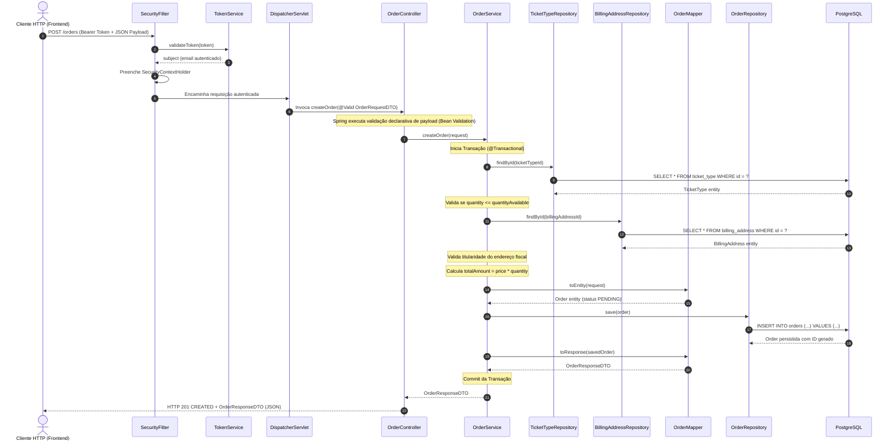
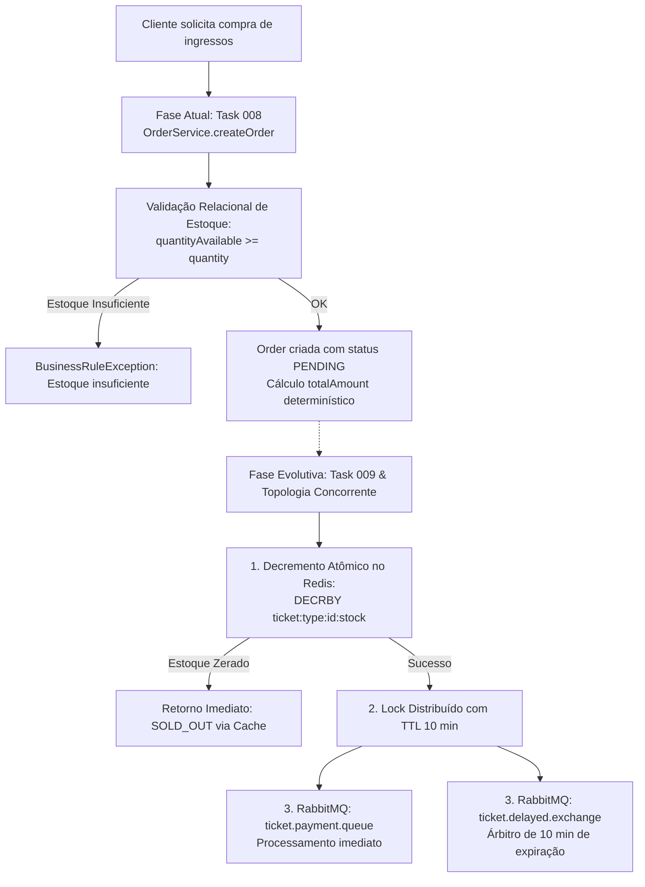

# Arquitetura de Ponta a Ponta: Ticket Booking System

Este documento detalha o desenho arquitetural do **Ticket Booking System**, explicando a responsabilidade de cada pasta, o ciclo de vida e tráfego de uma requisição HTTP da borda ao banco de dados, as anotações do ecossistema Spring utilizadas e as estratégias de concorrência adotadas.

---

## 📁 1. Estrutura do Projeto e Papel de Cada Pasta

O projeto adota uma **Arquitetura em Camadas com Sub-pacotes por Domínio de Negócio (Package-by-Feature inside Layer)**, garantindo forte encapsulamento, coesão temática e facilidade de manutenção:

```
src/main/java/com/hanniel/ticketBookingSystem/
├── config/                  # Configurações de infraestrutura e beans do framework
│   ├── openapi/             # Configuração do OpenAPI 3.0 / Swagger UI e esquemas de segurança
│   ├── redis/               # Conexão Lettuce e templates de acesso ao Redis Cache
│   └── security/            # SecurityFilterChain, filtros de autorização JWT e TokenService
├── controllers/             # Camada de Apresentação REST (Controladores Web)
│   ├── auth/                # Endpoints de autenticação (/auth/login, /auth/register)
│   ├── billingAddress/      # Endpoints fiscais e de endereço (/billing-addresses/**)
│   ├── event/               # Endpoints de criação e listagem de eventos (/events/**)
│   ├── order/               # Endpoints de checkout e pedidos (/orders/**)
│   └── ticket/              # Endpoints de emissão e categorias de ingressos (/tickets/**)
├── domain/                  # Camada de Entidades de Domínio e Modelagem Relacional JPA
│   ├── billingAddress/      # Entidade BillingAddress
│   ├── event/               # Entidade Event
│   ├── order/               # Entidade Order e Enum OrderStatus (Máquina de Estados)
│   ├── ticket/              # Entidades Ticket, TicketType e Enum TicketStatus
│   └── user/                # Entidade User e Enum UserRole
├── dtos/                    # Contratos de Transferência de Dados (Java 25 Records Imutáveis)
│   ├── auth/                # Payloads de login, registro e tokens
│   ├── billingAddress/      # Payloads de endereço de cobrança
│   ├── event/               # Payloads de criação e resposta de eventos
│   ├── order/               # Payloads de checkout (OrderRequestDTO, OrderResponseDTO)
│   └── ticket/              # Payloads de categorias e ingressos
├── exceptions/              # Tratamento Global e Exceções de Domínio
│   ├── auth/                # Exceções específicas de autenticação (InvalidCredentials, etc.)
│   └── global/              # GlobalExceptionHandler (@ControllerAdvice), ErrorResponse, BusinessRuleException
├── helper/                  # Classes utilitárias puras
│   └── date/                # DateHelper para conversões e formatações temporais padronizadas
├── mappers/                 # Mapeadores de Domínio e DTOs via MapStruct
│   ├── billingAddress/      # BillingAddressMapper
│   ├── event/               # EventMapper
│   ├── order/               # OrderMapper
│   └── ticket/              # TicketMapper, TicketTypeMapper
├── repositories/            # Camada de Acesso a Dados (Spring Data JPA Repositories)
│   ├── billingAddress/      # BillingAddressRepository
│   ├── event/               # EventRepository
│   ├── order/               # OrderRepository
│   ├── ticket/              # TicketRepository, TicketTypeRepository
│   └── user/                # UserRepository
└── services/                # Camada de Regras de Negócio e Transações (@Service)
    ├── auth/                # Regras de autenticação e geração de tokens
    ├── billingAddress/      # Regras de validação e isolamento fiscal por usuário
    ├── event/               # Validações temporais e regras de eventos
    ├── order/               # Orquestração do checkout, integridade de estoque e status
    ├── ticket/              # Ciclo de vida e loteamento de ingressos
    └── user/                # Integração com Spring Security UserDetailsService

src/main/resources/
├── application.properties   # Configurações de ambiente, datasource, flyway e redis
└── db/migration/            # Migrações relacionais versionadas via Flyway (DDL estrutural)

src/test/java/com/hanniel/ticketBookingSystem/
├── config/                  # Testes das regras de segurança e tokens
├── controllers/             # Testes de integração Web MVC (@WebMvcTest) isolados por feature
├── helper/                  # Testes unitários de utilitários
└── services/                # Testes unitários com Mockito (@ExtendWith(MockitoExtension.class))
```

---

## 🔄 2. Fluxo de uma Requisição de Ponta a Ponta

Para ilustrar o ciclo de vida completo de uma operação, consideramos a requisição de inicialização de checkout:
`POST /orders` acompanhado de um header `Authorization: Bearer <jwt_token>`.

### Diagrama de Sequência



### Detalhamento das Etapas:

1. **Filtro de Borda e Segurança (`SecurityFilter` & `OncePerRequestFilter`)**:
   - A requisição HTTP entra pela porta 8080 no container Tomcat embutido.
   - O `SecurityFilter` intercepta o request, extrai o header `Authorization` e repassa o Bearer Token para o `TokenService`.
   - O `TokenService` valida a assinatura HMAC-SHA256, checa o prazo de expiração e extrai o subject (email).
   - O usuário autenticado é localizado e alocado no `SecurityContextHolder`, estabelecendo a identidade da thread atual.
2. **Roteamento e Despacho (`DispatcherServlet`)**:
   - O Spring MVC roteia a chamada para `OrderController.createOrder`.
3. **Validação Declarativa (`Jakarta Validation`)**:
   - A presença da anotação `@Valid` faz o Spring validar todos os constraints declarados no record `OrderRequestDTO` (`@NotNull`, `@Positive`, etc.).
   - Caso qualquer validação falhe, o framework lança `MethodArgumentNotValidException`, imediatamente capturada pelo `GlobalExceptionHandler` que retorna `400 BAD REQUEST` com os campos violados.
4. **Camada de Orquestração e Negócio (`OrderService`)**:
   - Sob o contexto de `@Transactional`, o serviço obtém as entidades relacionadas (`User`, `TicketType`, `BillingAddress`).
   - Aplica as regras estritas de domínio:
     - Se `quantity > ticketType.quantityAvailable`, lança `BusinessRuleException("Estoque insuficiente")`.
     - Valida a obrigatoriedade e conformidade do endereço fiscal: caso o endereço não pertença ao usuário autenticado, lança `BusinessRuleException("Endereço de cobrança não pertence ao usuário")`.
     - Calcula determinísticamente o `totalAmount` (`price * quantity`).
     - Atribui o estado inicial da máquina de estados: `OrderStatus.PENDING`.
5. **Persistência (`OrderRepository` & Hibernate JPA)**:
   - A entidade `Order` é salva pelo repositório que traduz a operação em SQL relacional com parâmetros preparados (`PreparedStatement`).
6. **Mapeamento e Serialização de Saída (`OrderMapper` & Jackson)**:
   - O `OrderMapper` (gerado em tempo de compilação pelo MapStruct) converte a entidade persistida para o Record imutável `OrderResponseDTO`, evitando expor a entidade JPA para a camada web.
   - O Controller envolve o resultado em `ResponseEntity.status(HttpStatus.CREATED).body(...)`, que o Jackson serializa para JSON no corpo da resposta HTTP `201 Created`.

---

## 🏷️ 3. Anotações do Ecossistema Spring Utilizadas

O projeto emprega o conjunto de anotações canônicas do Spring Boot 3.x/4.x:

| Camada | Anotação | Finalidade e Contexto de Uso |
| :--- | :--- | :--- |
| **Web / Controller** | `@RestController` | Especialização de `@Controller` que combina `@ResponseBody` para construir APIs REST que serializam retornos diretamente em JSON. |
| | `@RequestMapping` | Define a rota base dos endpoints HTTP (ex: `/orders`, `/events`). |
| | `@PostMapping`, `@GetMapping`, `@PutMapping`, `@DeleteMapping` | Mapeamento explícito de verbos HTTP para métodos do controlador. |
| | `@RequestBody` | Mapeia o corpo JSON da requisição HTTP para o Record DTO correspondente. |
| | `@PathVariable` | Extrai variáveis de caminho da URI (ex: `UUID id` em `/orders/{id}`). |
| | `@Valid` | Aciona a validação de Bean Validation em conformidade com as regras declaradas no DTO. |
| **Serviço & Negócio** | `@Service` | Declara a classe como um componente Spring de lógica de negócio e candidato à injeção de dependência. |
| | `@Transactional` | Gerencia limites transacionais no banco de dados com commit automático no retorno com sucesso e rollback automático em caso de `RuntimeException`. |
| **Persistência / JPA** | `@Repository` | Indica componentes de persistência do Spring Data JPA com tratamento e tradução de exceções de banco. |
| | `@Entity`, `@Table` | Mapeia a classe Java para a respectiva tabela relacional do PostgreSQL gerenciada pelo Hibernate. |
| | `@Id`, `@GeneratedValue` | Especifica a chave primária e a estratégia de geração (`GenerationType.UUID`). |
| | `@ManyToOne`, `@JoinColumn` | Define relacionamentos relacionais com carregamento preguiçoso (`fetch = FetchType.LAZY`) para evitar queries N+1. |
| | `@Enumerated(EnumType.STRING)` | Grava enums no banco como texto legível em vez de índices ordinais. |
| **Segurança** | `@Configuration` | Marca classes como fonte de definição de beans gerenciados pelo contexto Spring. |
| | `@EnableWebSecurity` | Habilita os filtros e recursos de segurança do Spring Security. |
| | `@Bean` | Instancia e expõe beans configurados manualmente (ex: `SecurityFilterChain`, `PasswordEncoder`). |
| **Tratamento de Erros** | `@ControllerAdvice` | Interceptador global para tratamento centralizado de exceções disparadas em qualquer controller. |
| | `@ExceptionHandler` | Especifica métodos manipuladores para exceções específicas (`BusinessRuleException`, `ResourceNotFoundException`, etc.). |
| **Documentação (OpenAPI)** | `@Tag`, `@Operation`, `@ApiResponses`, `@Schema` | Documentação interativa no Swagger UI sem afetar a lógica de execução. |
| **Testes** | `@ExtendWith(MockitoExtension.class)` | Inicializa mocks do Mockito para testes unitários isolados na camada de serviço. |
| | `@WebMvcTest` | Sobe fatia isolada da camada Web para validação de endpoints, rotas e serialização. |
| | `@AutoConfigureMockMvc` | Configura e injeta o objeto `MockMvc` para chamadas simuladas aos controladores. |
| | `@MockitoBean` | Registra e substitui beans por mocks no contexto Spring de testes. |

---

## ⚡ 4. Decisões de Concorrência Tomadas Até Aqui e Evolução

A arquitetura do **Ticket Booking System** foi planejada para operar sob cenários de abertura de vendas de alta demanda (flash sales). O tratamento de concorrência foi estruturado em fases complementares:

### 1. Java 25 & Virtual Threads (Project Loom)
- A aplicação utiliza Virtual Threads do Java 25.
- Em requisições bloqueantes de I/O (consultas JDBC no PostgreSQL, chamadas de rede ao Redis), a thread virtual é desmontada da thread de carrier do sistema operacional, permitindo que a aplicação sirva dezenas de milhares de requisições concorrentes com consumo de memória negligível e sem saturação do pool de threads do SO.

### 2. Validação Relacional Síncrona vs. Bloqueio Distribuído Atômico



#### A. Estado Atual (Fase 1 - Task 008):
- **Criação Segura e Determinística:** A criação da ordem valida síncronamente o estoque relacional registrado em banco (`TicketType.quantityAvailable`).
- **Isolamento de Estado:** A ordem nasce no estado imutável `PENDING`, vinculada ao usuário e a um `BillingAddress` comprovadamente pertencente a ele.
- **Imutabilidade e Thread-Safety:** O uso de Records no transporte de dados impede efeitos colaterais de modificação de estado em múltiplos threads.

#### B. Arquitetura de Concorrência Distribuída (Próxima Etapa - Task 009+):
Para garantir tolerância sob centenas de milhares de requisições simultâneas sem gerar gargalos de locks pessimistas (`SELECT FOR UPDATE`) no PostgreSQL:
1. **Reserva Atômica em Memória (`DECRBY` no Redis):**
   - O estoque real disponível em pico será mantido em memória no Redis.
   - O comando atômico `DECRBY` do Redis subtrai a quantidade solicitada em milissegundos. Se o valor resultante for menor que zero, a operação reverte com `INCRBY` e rejeita a compra sem tocar no banco de dados.
2. **Reserva Temporária com TTL de 10 minutos:**
   - O ingresso reservado fica bloqueado no Redis por 10 minutos, garantindo a garantia de compra enquanto o usuário insere os dados de pagamento.
3. **Árbitro Oficial de Expiração via Delayed Exchange (RabbitMQ):**
   - No momento da reserva, duas mensagens assíncronas são disparadas:
     - `ticket.payment.queue`: Processa a cobrança imediatamente com o gateway de pagamento.
     - `ticket.delayed.exchange`: Fila com atraso configurado em 10 minutos.
   - Se após 10 minutos o status do pedido não tiver transitado para `PAID`, o worker de compensação cancela a ordem no PostgreSQL e executa `INCRBY` no Redis, devolvendo os ingressos ao lote disponível sem intervenção manual.
4. **Atualizações Reativas em Tempo Real (Server-Sent Events - SSE):**
   - Em caso de falha de cobrança síncrona pelo gateway, o backend altera o status para `PAYMENT_REJECTED` e transmite o evento instantaneamente para a sessão do usuário via SSE, possibilitando nova tentativa de pagamento dentro da janela de 10 minutos.

---

## 🏁 5. Conclusão

A arquitetura do **Ticket Booking System** concilia a robustez de um modelo transacional relacional com o isolamento em camadas, tipagem estrita via Records do Java 25, testes de regressão automatizados e preparação transparente para o throughput massivo via cache e mensageria distribuída.
